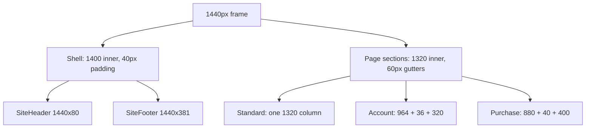

# Layout architecture

Stage A reverse engineering, before any layout code. Derived from
`get_design_context` on `SiteHeader` / `SiteFooter` and `get_metadata` on one
representative screen per pattern.

Every measurement here is an exact Figma value.

---

## The invariant

All four patterns are 1440px wide with **60px page gutters**, giving a **1320px
content band**. Each pattern then splits that band differently:

- Standard pages — single 1320 column
- Account pages — `964 + 36 gap + 320`
- Purchase pages — `880 + 40 gap + 400`

The shell components are the exception: `SiteHeader` and `SiteFooter` use an
inner width of **1400** with **40px** padding (`--space-gutter-desktop`), not 60.
That is why `--size-content-max` is 1400 while sections are 1320.



---

## Pattern A — MainLayout

Verified on Home `207:4362`. Used by the browse, detail, marketing and error
pages — the large majority of the 52 screens.

```
MainLayout
├── SiteHeader                    instance, 1440x80, sticky, backdrop blur
├── <Outlet>                      vertical stack of full-bleed sections
│     └── PageSection             1440 wide, content inset to 1320 at x=60
└── SiteFooter                    instance, 1440x381
```

Sections are full-bleed so they can carry their own background, with the 1320
band centred inside. Vertical rhythm is per-section, not uniform: Home runs
Hero 60, Talents 84, Categories 72, Events 60, Featured 76, then 88 for Auction,
Experiences, Organizers and Vendors, 96 for CTA, and 72 top / 96 bottom for
BusinessStrip. So `PageSection` must accept its top padding rather than assume
`--space-5xl-max`.

## Pattern B — AccountLayout

Verified on My Tickets `207:9469`. Used by the eleven account screens plus the
three ticket actions and the support screens.

```
AccountLayout
├── SiteHeader                    1440x80
├── Head                          1440x218
│    ├── Title row                x=60, 1320 wide, 106 tall
│    │    ├── Titles              eyebrow + H1 + sub
│    │    └── Head actions        right-aligned button cluster, 40 tall
│    └── Tabs                     x=60, 1320 wide, 46 tall
│         └── Tab                 44 tall row + 2px underline
├── Body                          1440
│    ├── Main                     x=60,   964 wide
│    └── Aside                    x=1060, 320 wide
├── spacer                        96
└── SiteFooter                    1440x381
```

The tab underline is a 2px bar the full width of the tab, and each tab row
carries an optional count chip after the label. This is a different component
from the design system's `Tabs` (`207:2841`), which is 31 tall with no count —
the account tab bar is its own thing and should not be forced into `Tabs`.

## Pattern C — AuthLayout

Verified on Sign In `207:11907`. Used by Sign In and Register.

```
AuthLayout                        1440x910, no header, no footer
└── Split
     ├── Hero panel               x=0,   702 wide, full height
     └── Form column              x=702, 738 wide
          └── Auth card           428 wide, centred (155px each side)
               ├── Mode tabs      428x46, two 207-wide tabs — Sign in / Create account
               ├── H1 + lead
               ├── Fields         two fields, 50 tall inputs
               ├── Keep signed in checkbox row
               ├── CTA primary    428x52
               ├── CTA secondary  428x52 — one-time code
               ├── Or divider     rule 151 + label + rule 151
               ├── Socials        three 136x48 buttons — Apple, Google, Nafath
               ├── Business notice
               └── Keep browsing  back link
```

**The split is 702/738, not 50/50.** `implementation-guide.md` says "Split (50/50
horizontal)", which would be 720/720. Building it at 720 would shift the form
column 18px and break the 428 card's centring.

Note the auth inputs are **50 tall**, whereas the design system `TextInput` is
**48**. Sign In also renders its own mobile-number input with a dial-code prefix
and divider rather than using the `TextInput` component.

## Pattern D — PurchaseLayout

Verified on Checkout `207:8228`. Used by Seat Selection and Checkout.

```
PurchaseLayout
├── Purchase header               1440x72 — NOT SiteHeader
│    ├── Back pair                x=60,   arrow-left@14 + label
│    ├── Logo                     x=196,  62x34
│    ├── Steps                    x=286,  926 wide, three numbered steps
│    └── Hold timer               x=1240, 140x33, label + countdown
└── Body
     ├── Main                     x=60,  880 wide
     └── Aside                    x=980, 400 wide
```

No `SiteFooter` — the purchase flow deliberately has no footer, so the layout
must not render one. The 22px-dot numbered steps and the hold timer are unique
to this header; the timer pairs with the `Countdown` component.

Order Confirmation (`207:8462`) sits outside this pattern; it is a standard page.

---

## Reuse decisions

**Extract as shared layout components**

- `MainLayout`, `AccountLayout`, `AuthLayout`, `PurchaseLayout` — four route-level
  shells
- `PageSection` — full-bleed section with a 1320 centred band and caller-supplied
  vertical padding
- `SiteHeader`, `SiteFooter` — used by three of the four shells
- `PurchaseHeader` — only two screens, but it is 1440x72 with four positioned
  slots and no relation to `SiteHeader`, so it is its own component
- `AccountPageHead` — the title-row-plus-tabs block, shared across roughly
  seventeen account, ticket-action and support screens
- `AccountTabBar` — the 46-tall tab bar with counts, distinct from DS `Tabs`

**Do not extract**

- The auth `Mode tabs` — only Sign In and Register use it, and it is a
  two-up 207-wide segmented control unrelated to either tab component
- The Checkout `Steps` — Checkout and Seat Selection only, belongs to
  `PurchaseHeader`
- Per-screen `Aside` panel stacks — the panels themselves (`Wallet`,
  `Also in your account`, suggestion lists) are page content, not layout

---

## SiteHeader

Node `207:2936`, variants `State=Signed out` (`207:2937`) and
`State=Signed in` (`207:2954`). 1440x80.

Root: `--bg-page` fill, 1px `--border-default` bottom border, background blur.
Inner content 1400 wide, `--space-gutter-desktop` (40) horizontal padding, full
height, `gap 38`.

```
SiteHeader
├── Logo                 73x40
├── Nav                  gap 24 (--space-2xl)
│    └── NavItem x5      Events, Talents, Organizers, Vendors, Experiences
├── grow spacer          flex-1
├── Search slot          w 300, min 200, max 300
│    └── SearchPill      fills the slot
└── Auth cluster         gap 14
     ├── Language pill   h36, px13, radius pill, 1.5px border, "العربية"
     ├── Sign in         h42, px18, radius 21, 1.5px border, heart@16 + label
     └── Create account  h42, px18, radius 21, brand gradient at 152.54deg
```

Two things from the Figma component description that must be honoured:

**Nav active state is driven by the NavItem instance, not by restyling the
label.** `NavItem` has three states. `Default` is `--ink-primary` with no rule.
`Active` is `#D8431A` with a 2px `--brand-primary` bottom rule and 4px bottom
padding, used by the five listing pages on their own item. `Section` is plain
`--brand-primary` with no rule, used by the four detail pages on their parent
section's item. Home, Event Details, Search Results and Auction have no active
item.

**The blur is 7px in CSS.** Figma's `Blur/Header` effect radius is 14; the
generated code renders `backdrop-blur-[7px]`. Figma blur radius maps to CSS at
half its value.

The `SearchPill` description flags an overlap with `SearchField[Size=Field]`:
identical paint and metrics, but `SearchField` is fixed at 240 wide while
`SearchPill` is built to flex between 200 and 300 for the header slot. Both are
kept — `SearchPill` for the header, `SearchField` everywhere else.

The gradient on Create account is `152.54deg`, not the horizontal `90deg` the
brand ramp uses elsewhere.

## SiteFooter

Node `207:2977`, variants `Size=Full` (`207:2978`, 1440x381) and
`Size=Minimal` (`207:3036`, 1440x80). `--bg-warm` fill, 1px `--border-default`
top border, inner 1400.

```
SiteFooter (Full)
├── Columns              pt 56, pb 32, px 40, gap 40
│    ├── Brand column    FIXED 300.741 wide
│    │    ├── Logo       80.3x44
│    │    ├── Blurb      300 wide, Body/Small, --ink-secondary
│    │    ├── App pills  two, radius 12, py9 px14, gap 8
│    │    └── Social     four links, 13/600, gap 14
│    └── Link column x4  FILL
│         ├── Heading    Label/Overline in --ink-brand-mid
│         └── Links      Body/Small, --ink-primary, gap 9
└── Bottom bar           1400, pt 20, pb 40, px 40, 1px top rule
     ├── Copyright       left
     └── Location        right
```

The four link columns are `flex: 1` and the brand column is pinned at 300.741.
The Figma description explains why: the design is a `1.4fr 1fr 1fr 1fr 1fr` grid
inside `1400 - 2*40`, and Figma auto-layout cannot express fractional grow, so
only the 1.4fr track needed pinning. In CSS we can express the original intent
directly with `grid-template-columns: 1.4fr 1fr 1fr 1fr 1fr`, which is more
faithful than reproducing the 300.741 workaround.

Column headings are `#D8431A`, which is `--ink-brand-mid`.

`Size=Minimal` is the bottom bar alone, with no top border on the shell so the
bar's own rule is not doubled.

All twenty link strings, both bottom-bar strings and the blurb are verbatim
content from the design and are captured in the component artifact.

---

## Tokens found outside the foundations

`get_design_context` surfaced variables that the three Foundations frames do not
reference, which means the foundations are not a complete token dump:

- `--space-btn-pad-md` 18 — button horizontal padding at size M
- `--radius-btn-md` 21 — button radius at size M, consistent with the `Button`
  description's "Radius = height/2" rule against its 42 height

**A second typeface exists.** The language pill renders `العربية` in
`Cairo Bold`. Manrope is the Latin face — hence the token name `--font-latin` —
and Cairo is the Arabic face. The design system documentation never mentions
this. Arabic support needs `--font-arabic` and the Cairo family loaded.
